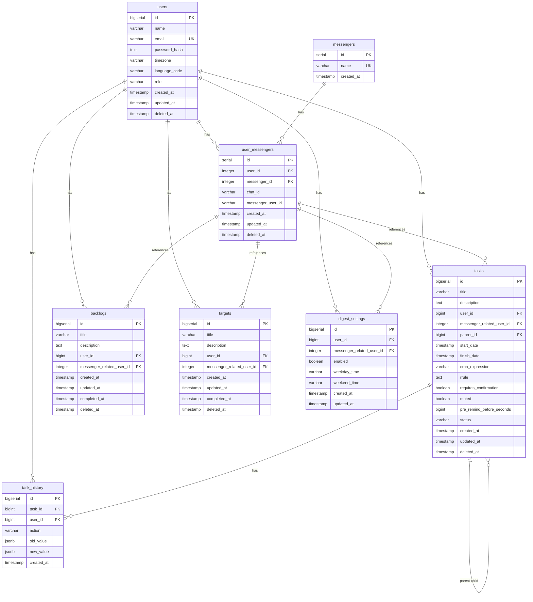

<p align="center">

</p>
<h1 align="center">GoReminder</h1>
<p align="center">A comprehensive task management API built with Go</p>
<p align="center">
  <a href="https://github.com/boskuv/goreminder/actions/workflows/ci.yml"></a>
  <a href="https://go.dev/"></a>
  <a href="LICENSE"></a>
  <a href="https://hub.docker.com/r/boris24kv/goreminder-api"></a>
  
</p>

## Contents

| | |
|---|---|
| **Start here** | [Features](#business-features) · [Prerequisites](#prerequisites) · [Quick start](#setup-instructions) |
| **Reference** | [Configuration](#configuration) · [API](#api-documentation) · [Filtering](#filtering-and-ordering) |
| **Domain** | [Muting](#task-muting-muted) · [Pre-remind](#pre-remind-pre_remind_before_seconds) · [Task types](#task-types) · [Schema](#database-schema) |
| **Integrations** | [Google Calendar](docs/google-calendar.md) |
| **Dev** | [Testing](#testing) · [Development](#development) · [Architecture](#architecture) |

> Long sections (schema, full config, middleware, curl examples, …) are folded behind **Expand** / summary toggles.

## Business Features
- [x] **Auto-rescheduling**: Tasks are automatically rescheduled to the next day if confirmation is not received
- [x] **Daily Task Digest**: Configure digest settings and fetch digest payloads via API
- [x] **Backlog Zone**: Tasks without fixed time and confirmation requirements
- [x] **Targets/Goals Management**: Create and track targets (aims/goals) with completion tracking
- [x] **Task Muting**: Per-task silence for the worker queue (see [Task muting (`muted`)](#task-muting-muted)).
- [x] **Reminder Groups**: Group related tasks together for batch management / calendar sync scope
- [ ] **ICS Import**: Import tasks from iCalendar (.ics) files
- [x] **Google Calendar**: Per-user OAuth, multi-calendar import/export of Events (see [docs/google-calendar.md](docs/google-calendar.md))
- [x] **Advanced Reminders**: Optional preliminary reminder before `start_date` (`pre_remind_before_seconds`; see [Pre-remind](#pre-remind-pre_remind_before_seconds)).

## Tech Features
- **Task Management**: Create, fetch, update, and delete tasks with soft delete support
- **User Management**: Create, fetch, update, and delete users with soft delete support
- **Target Management**: Create, fetch, update, and delete targets (aims/goals) with soft delete support
- **Backlog Management**: Create, fetch, update, and delete backlog items with batch creation support
- **Messenger Integration**: Support for multiple messaging platforms (Telegram, etc.)
- **RESTful API**: Built with Gin framework for fast HTTP routing
- **Swagger API Documentation**: Auto-generated interactive API documentation
- **Pagination**: Built-in pagination support for list endpoints with page, page_size, and total_pages
- **Filtering & Ordering**: Advanced filtering and ordering capabilities for tasks
- **Request Validation**: Custom validators for cron expressions, task status, and future dates; recurring tasks additionally validate RRULE strings in the service layer when `rrule` is set
- **Observability**: 
  - **Metrics**: Prometheus metrics with HTTP request duration and count
  - **Tracing**: OpenTelemetry integration with Jaeger for distributed tracing
  - **Structured Logging**: Zerolog for structured, context-aware logging
- **Message Queue**: RabbitMQ integration for asynchronous task processing with retry support (can be disabled for DB-only mode)
- **Containerized Setup**: Docker Compose for local dependencies (`docker-compose.dev.yml`)
- **Database Migrations**: Goose-based migration system
- **Task Attachments**: REST BFF in core + separate attachments gRPC service (hybrid presigned / direct multipart upload, optional proxy download; contract in `api/proto/attachments/v1/`)
- **Testing**: Go unit tests (service layer + gomock; CI on PRs) and Python E2E tests

## Prerequisites
- Docker and Docker Compose
- Go 1.25 or later
- `make` for build automation
- `golangci-lint` for code linting
- `goose` for database migrations
- `swag` for generating Swagger docs
- `mockgen` (`go.uber.org/mock`) for repository mocks
- `protoc` (optional, for `make proto-attachments`)
- Python 3.x (for E2E tests)

## Project Structure

<details>
<summary>Expand tree</summary>

```
.
├── cmd/core/              # API server (REST BFF) + config.yaml
├── api/                   # attachments gRPC contract (proto + gen)
├── docs/                  # Swagger + dbml
├── internal/
│   ├── api/               # handlers, routes, middleware, dto, validation
│   ├── models/ repository/ service/ mocks/ errors/
├── migrations/            # goose SQL
├── pkg/                   # config, database, queue, attachments client, observability, …
├── examples/              # Python API client, sample Telegram bot, sample queue worker
├── tests/                 # Python E2E
├── docker-compose.dev.yml # Postgres, RabbitMQ, tracing (local deps)
└── .github/workflows/     # CI (go test) + Docker image publish
```

The attachments **service** (S3/MinIO + its DB) lives in a **separate repository**; this repo only hosts the REST BFF and gRPC client (`pkg/attachments`).

</details>


<details>
<summary><strong>Queue Contracts</strong></summary>

## Queue Contracts

The API publishes messages to RabbitMQ using a simple, Celery-style JSON contract:

```json
{
  "task": "worker.schedule_task",
  "args": [
    "<messenger_name>",
    "<chat_id>",
    "<task_id>",
    "<title>",
    "<description>",
    "<start_date>",
    "<cron_expression|null>",
    "<requires_confirmation>",
    "<pre_remind_before_seconds|null>"
  ]
}
```

This payload is represented in code by the low-level `queue.TaskMessage` struct and is sent via the `queue.Publisher` interface. At the domain level, task messages are modeled as `queue.TaskEvent` with a `TaskEventType` (`schedule_task`, `delete_task`, etc.), which are mapped to the Celery-style JSON. The seventh argument still reflects the task row’s `cron_expression` only; executable child tasks usually have both `cron_expression` and `rrule` unset, with the parent holding `rrule` in the database. Workers that need the RRULE string should resolve it via `task_id` (for example from the API or DB). The ninth argument is optional preliminary-reminder offset in seconds (`null` when unset); sample worker schedules a separate `{messenger}_{task_id}_pre` job. For deployments that should not use RabbitMQ, set `producer.enabled: false` in the config – the application will then use a no-op publisher and work purely at the database level.

`internal/models.ScheduledTask` uses explicit action values (`"schedule"`, `"delete"`) via `ScheduledTaskActionSchedule` and `ScheduledTaskActionDelete` constants, which are dispatched in `TaskService.QueueTask` and converted into `queue.TaskEvent` instances before publishing.

</details>

<details>
<summary><strong>Database Schema</strong></summary>

## Database Schema


```mermaid
erDiagram
    users ||--o{ tasks : "has"
    users ||--o{ user_messengers : "has"
    users ||--o{ backlogs : "has"
    users ||--o{ targets : "has"
    users ||--o{ digest_settings : "has"
    users ||--o{ task_history : "has"
    
    messengers ||--o{ user_messengers : "has"
    
    user_messengers ||--o{ tasks : "references"
    user_messengers ||--o{ backlogs : "references"
    user_messengers ||--o{ targets : "references"
    user_messengers ||--o{ digest_settings : "references"
    
    tasks ||--o{ tasks : "parent-child"
    tasks ||--o{ task_history : "has"
    
    users {
        bigserial id PK
        varchar name
        varchar email UK
        text password_hash
        varchar timezone
        varchar language_code
        varchar role
        timestamp created_at
        timestamp updated_at
        timestamp deleted_at
    }
    
    tasks {
        bigserial id PK
        varchar title
        text description
        bigint user_id FK
        integer messenger_related_user_id FK
        bigint parent_id FK
        timestamp start_date
        timestamp finish_date
        varchar cron_expression
        text rrule
        boolean requires_confirmation
        boolean muted
        bigint pre_remind_before_seconds
        varchar status
        timestamp created_at
        timestamp updated_at
        timestamp deleted_at
    }
    
    messengers {
        serial id PK
        varchar name UK
        timestamp created_at
    }
    
    user_messengers {
        serial id PK
        integer user_id FK
        integer messenger_id FK
        varchar chat_id
        varchar messenger_user_id
        timestamp created_at
        timestamp updated_at
        timestamp deleted_at
    }
    
    backlogs {
        bigserial id PK
        varchar title
        text description
        bigint user_id FK
        integer messenger_related_user_id FK
        timestamp created_at
        timestamp updated_at
        timestamp completed_at
        timestamp deleted_at
    }
    
    targets {
        bigserial id PK
        varchar title
        text description
        bigint user_id FK
        integer messenger_related_user_id FK
        timestamp created_at
        timestamp updated_at
        timestamp completed_at
        timestamp deleted_at
    }
    
    digest_settings {
        bigserial id PK
        bigint user_id FK
        integer messenger_related_user_id FK
        boolean enabled
        varchar weekday_time
        varchar weekend_time
        timestamp created_at
        timestamp updated_at
    }
    
    task_history {
        bigserial id PK
        bigint task_id FK
        bigint user_id FK
        varchar action
        jsonb old_value
        jsonb new_value
        timestamp created_at
    }
```

### Table Relationships

- **users** ↔ **tasks**: One-to-many (CASCADE delete)
- **users** ↔ **user_messengers**: One-to-many (CASCADE delete)
- **users** ↔ **backlogs**: One-to-many (CASCADE delete)
- **users** ↔ **targets**: One-to-many (CASCADE delete)
- **users** ↔ **digest_settings**: One-to-many (CASCADE delete)
- **users** ↔ **task_history**: One-to-many (CASCADE delete)
- **messengers** ↔ **user_messengers**: One-to-many (CASCADE delete)
- **user_messengers** ↔ **tasks**: One-to-many (SET NULL on delete)
- **user_messengers** ↔ **backlogs**: One-to-many (SET NULL on delete)
- **user_messengers** ↔ **targets**: One-to-many (SET NULL on delete)
- **user_messengers** ↔ **digest_settings**: One-to-many (SET NULL on delete)
- **tasks** ↔ **tasks**: Self-referential (parent-child relationship for recurring tasks)
- **tasks** ↔ **task_history**: One-to-many (CASCADE delete)

### Key Features

- **Soft Deletes**: `users`, `tasks`, `user_messengers`, `backlogs`, and `targets` support soft deletes via `deleted_at` column
- **Recurring Tasks**: Tasks can have a `parent_id` pointing to another task, enabling parent-child relationships for recurring tasks. Recurrence on the parent is defined by either `cron_expression` or `rrule` (iCalendar RRULE), never both.
- **Task History**: All task changes are tracked in `task_history` table with JSONB fields for old/new values
- **Messenger Integration**: Users can link multiple messenger accounts via `user_messengers` table
- **Digest Settings**: Users can configure daily digest times per messenger account

### Alternative Visualization

For a more detailed interactive diagram, you can use the [dbdiagram.io](https://dbdiagram.io) file located at `docs/database_schema.dbml`. Simply copy the contents and paste them into dbdiagram.io for an interactive ER diagram.

</details>

## Configuration

The application supports configuration via YAML files and environment variables. Environment variables take precedence over YAML file values. See `cmd/core/config.yaml` / `cmd/core/config.yaml.example` (example may lag behind newer keys such as `attachments.*` and `autoreschedule`).

### Configuration Sources

1. **YAML File** (default): Primary configuration source
2. **Environment Variables** (optional): Override YAML values

You can use either YAML file only, environment variables only, or a combination of both.

### Environment Variables

Environment variables use the prefix `GOREMINDER_` and nested keys are separated by underscores. For example:

- `GOREMINDER_SERVER_PORT=8080`
- `GOREMINDER_DATABASE_HOST=localhost`
- `GOREMINDER_DATABASE_PASSWORD=secret`
- `GOREMINDER_PRODUCER_HOST=rabbitmq`

**Examples:**

```bash
# Override specific values from YAML
export GOREMINDER_SERVER_PORT=9090
export GOREMINDER_DATABASE_HOST=production-db
export GOREMINDER_DATABASE_PASSWORD=secure-password

# Use only environment variables (no YAML file needed)
export GOREMINDER_SERVER_PORT=8080
export GOREMINDER_SERVER_SECRET=my-secret
export GOREMINDER_SERVER_MODE=production
export GOREMINDER_DATABASE_DRIVER=postgres
export GOREMINDER_DATABASE_DBNAME=mydb
export GOREMINDER_DATABASE_USERNAME=user
export GOREMINDER_DATABASE_PASSWORD=pass
export GOREMINDER_DATABASE_HOST=localhost
export GOREMINDER_DATABASE_PORT=5432
# ... set other required variables
```

**Note:** When using environment variables only, you can pass an empty string as config path: `./goreminder -config=""`

<details>
<summary><strong>Full configuration reference (YAML)</strong></summary>

### Configuration Structure

```yaml
server:
  port: 8080                    # Server port
  mode: development            # development | production | test
  secret: dev-secret            # Application secret

database:
  driver: postgres              # Database driver
  dbname: task_manager          # Database name
  username: postgres            # Database username
  password: password            # Database password
  host: postgres                # Database host
  port: 5432                    # Database port
  maxOpenConns: 100             # Maximum open connections
  maxIdleConns: 10              # Maximum idle connections
  connMaxLifetime: 30m          # Connection max lifetime (duration format)
  maxRetries: 3                 # Maximum retry attempts for database operations

attachments:
  enabled: false                # Enable attachments gRPC client + REST routes
  grpcAddr: "localhost:50051"   # Attachments gRPC service (separate repo / process)
  timeout: "5s"                 # Per-RPC timeout
  directUploadMaxBytes: 2097152 # Max multipart upload on POST .../attachments (default 2 MiB)
  proxyDownloadEnabled: true    # GET .../content proxies bytes via API (default true in code)
  proxyDownloadMaxBytes: 2097152 # Max size for proxy download (default 2 MiB)
  purgeOnTaskDone: false        # Purge attachments after POST .../done (requires enabled: true)

producer:
  enabled: true                 # Enable RabbitMQ producer (false = DB-only mode)
  host: rabbitmq                # RabbitMQ host
  port: 5672                    # RabbitMQ port
  user: guest                   # RabbitMQ username
  password: guest                # RabbitMQ password
  queueName: celery             # Queue name
  exchange: celery               # Exchange name
  connectionRetries: 5          # Connection retry attempts
  connectionRetryDelay: 2       # Delay between retries (seconds)

tracing:
  enabled: true                 # Enable OpenTelemetry tracing
  endpoint: localhost:4318      # OTLP endpoint
  serviceName: goreminder-api   # Service name for tracing
  insecure: true                 # Use insecure connection

metrics:
  enabled: true                 # Enable Prometheus metrics
  addr: :9191                   # Metrics server address

ratelimit:
  enabled: true                 # Enable rate limiting
  requests: 100                  # Requests allowed per window
  window: 1m                    # Time window (duration format)

cors:
  enabled: true                 # Enable CORS
  allowOrigins:                 # Allowed origins
    - "*"
  allowMethods:                 # Allowed HTTP methods
    - GET
    - POST
    - PUT
    - DELETE
    - OPTIONS
    - PATCH
  allowHeaders:                 # Allowed headers
    - Content-Type
    - Authorization
    - X-Request-ID
  exposeHeaders:                # Exposed headers
    - X-Request-ID
  allowCredentials: false       # Allow credentials
  maxAge: 3600                  # Preflight cache max age (seconds)

autoreschedule:
  enabled: false                # Enable automatic rescheduling of tasks whose startDate is already in the past
  time: "00:00"                 # Daily run time in UTC (HH:MM, 24-hour). Default 00:00 when enabled.
```

#### Autoreschedule Configuration

The `autoreschedule` option controls whether the task scheduler should run automatically to reschedule tasks.

**Behavior:**
- **When `enabled: false`** (default): The task scheduler is **not** started. Tasks are not automatically rescheduled.
- **When `enabled: true`**: The task scheduler runs daily at the specified UTC time to automatically reschedule tasks that need rescheduling.

**Time Format:**
- The `time` field specifies the UTC time when the scheduler should run daily (format: `HH:MM`, 24-hour format)
- Default value: `"00:00"` (midnight UTC) if `enabled: true` but `time` is not specified
- Valid format: `00:00` to `23:59`
- Example: `"14:30"` means the scheduler runs daily at 2:30 PM UTC

**What the Scheduler Does:**
- Finds tasks that need rescheduling (tasks with `startDate` in the past that require confirmation)
- Finds parent tasks with a recurrence rule (`cron_expression` or `rrule`) that need their `startDate` updated
- Automatically reschedules these tasks

**Use Cases:**
- Enable autoreschedule to automatically handle tasks that have passed their scheduled time
- Useful for maintaining task schedules without manual intervention
- When disabled, tasks must be manually rescheduled or updated

**Environment Variable:**
```bash
GOREMINDER_AUTORESCHEDULE_ENABLED=true
GOREMINDER_AUTORESCHEDULE_TIME=00:00
```

</details>

<details>
<summary><strong>Docker / Kubernetes env examples</strong></summary>

### Docker/Kubernetes Example

When deploying in containers, you can use environment variables instead of mounting config files:

```yaml
# docker-compose.yml example
services:
  api:
    image: goreminder:latest
    environment:
      - GOREMINDER_SERVER_PORT=8080
      - GOREMINDER_SERVER_MODE=production
      - GOREMINDER_DATABASE_HOST=postgres
      - GOREMINDER_DATABASE_DBNAME=task_manager
      - GOREMINDER_DATABASE_USERNAME=postgres
      - GOREMINDER_DATABASE_PASSWORD=${DB_PASSWORD}
      - GOREMINDER_PRODUCER_HOST=rabbitmq
      - GOREMINDER_PRODUCER_USER=guest
      - GOREMINDER_PRODUCER_PASSWORD=guest
      - GOREMINDER_AUTORESCHEDULE_ENABLED=true
      - GOREMINDER_AUTORESCHEDULE_TIME=00:00
```

Or in Kubernetes:

```yaml
# kubernetes deployment example
apiVersion: apps/v1
kind: Deployment
metadata:
  name: goreminder
spec:
  template:
    spec:
      containers:
      - name: api
        image: goreminder:latest
        env:
        - name: GOREMINDER_SERVER_PORT
          value: "8080"
        - name: GOREMINDER_DATABASE_HOST
          valueFrom:
            secretKeyRef:
              name: db-secret
              key: host
        - name: GOREMINDER_DATABASE_PASSWORD
          valueFrom:
            secretKeyRef:
              name: db-secret
              key: password
```

</details>

## Setup Instructions

### 1. Clone the Repository
```bash
git clone https://github.com/boskuv/goreminder.git
cd goreminder
```

### 2. Configure the Application
```bash
# Copy example configuration
cp cmd/core/config.yaml.example cmd/core/config.yaml

# Edit configuration as needed
vim cmd/core/config.yaml
```

### 3. Run Services with Docker
```bash
make docker-up
# or
docker compose -f docker-compose.dev.yml up --build
```

### 4. Run Database Migrations

The application automatically runs database migrations on startup. However, you can run them manually if needed:

```bash
# Ensure goose is installed
go install github.com/pressly/goose/v3/cmd/goose@latest

# Run migrations manually
goose -dir migrations postgres "host=localhost port=5432 user=postgres password=password dbname=task_manager sslmode=disable" up
```

**Note**: For local development, you can skip automatic migrations by setting the `SKIP_MIGRATIONS` environment variable:

```bash
# Skip migrations on startup (useful if you manage migrations manually)
SKIP_MIGRATIONS=true make run

# Or export it before running
export SKIP_MIGRATIONS=true
make run
```

You can also override the migrations directory using the `MIGRATIONS_DIR` environment variable:

```bash
# Use custom migrations directory
MIGRATIONS_DIR=custom_migrations make run
```

### 5. Run the Application

#### Debug Mode
Enable debug mode for enhanced logging and development features:
```bash
DEBUG=true make run
```

#### Release Mode
```bash
make run
```

### 6. Verify Services
- **PostgreSQL**: `localhost:5432`
- **API Server**: `localhost:8080`
- **Swagger UI**: `http://localhost:8080/docs/index.html`
- **Metrics**: `http://localhost:9191/metrics`
- **Jaeger UI**: `http://localhost:16686`

<details>
<summary><strong>Middleware</strong></summary>

## Middleware

The application uses multiple middleware layers (applied in order):

1. **Request ID Middleware**: Generates unique request IDs for tracing
   - Adds `X-Request-ID` header to requests/responses
   - Uses UUID v4 for request identification

2. **Logger Middleware**: Structured request logging
   - Logs method, path, status, latency, IP, user agent
   - Includes request ID in logs
   - Different log levels based on status codes

3. **CORS Middleware**: Cross-Origin Resource Sharing
   - Configurable allowed origins, methods, headers
   - Supports preflight requests
   - Can be enabled/disabled via configuration

4. **Rate Limit Middleware**: Request rate limiting
   - Token bucket algorithm
   - Limits by IP address
   - Configurable requests per time window
   - Can be enabled/disabled via configuration

5. **Metrics Middleware**: Prometheus metrics collection
   - HTTP request duration histogram
   - HTTP request count counter
   - Tagged by method, route, and status
   - Can be enabled/disabled via configuration

6. **Tracing Middleware**: OpenTelemetry distributed tracing
   - Automatic span creation for all requests
   - Integrates with Jaeger for visualization
   - Can be enabled/disabled via configuration

</details>

<details>
<summary><strong>Request Validation</strong></summary>

## Request Validation

The application includes custom validators for request validation:

### Custom Validators

1. **`cron`**: Validates cron expressions
   - Uses robfig/cron parser
   - Supports standard cron format
   - Example: `"0 9 * * *"` (daily at 9 AM)

2. **`rrule` (recurrence)**: When `rrule` is present on create/update, the service validates the string with [rrule-go](https://github.com/teambition/rrule-go) and rejects it if `cron_expression` is also set.

3. **`task_status`**: Validates task status values
   - Valid statuses: `pending`, `scheduled`, `done`, `rescheduled`, `postponed`, `deleted`
   - Returns HTTP 400 with descriptive error message

4. **`future_date`**: Validates that dates are in the future (UTC)
   - Ensures `start_date` is not in the past
   - Works with `time.Time` and `*time.Time` types
   - For task updates, validation is applied only when `start_date` is explicitly provided in payload (partial update semantics)
   - Returns HTTP 400 with error message: `"field 'start_date' must be a date in the future (UTC)"`

### Validation Error Handling

All validation errors return HTTP 400 (Bad Request) with descriptive error messages:
```json
{
  "error": "field 'start_date' must be a date in the future (UTC)"
}
```

</details>

<details>
<summary><strong>Observability</strong></summary>

## Observability

### Metrics
The application exposes Prometheus metrics at `/metrics` endpoint:
- **HTTP Request Duration**: Histogram of response times (`http_request_duration_seconds`)
- **HTTP Request Count**: Total number of requests by method, route, and status (`http_requests_total`)

### Tracing
OpenTelemetry tracing is integrated with Jaeger:
- Distributed tracing across all HTTP requests
- View traces in Jaeger UI at `http://localhost:16686`
- Automatic span creation for all API endpoints
- Request IDs are included in trace spans

### Logging
Structured logging using Zerolog:
- JSON-formatted logs
- Context-aware logging with request IDs
- Configurable log levels
- Request/response logging with latency tracking
- Audit-focused CRUD logs in service layer with unified `audit.*` attributes:
  - `audit.operation`, `audit.entity`, `audit.entity_id`
  - `audit.actor_id` (`unknown` when actor is not available in context)
  - `audit.changed_fields`, `audit.changed_count` for create/update/delete summaries
  - Sensitive values are not logged directly (for example, user password hash is represented as a boolean flag only)

### Task attachments

**Architecture**

| Component | Location | Role |
|-----------|----------|------|
| REST API | `internal/api/handlers/attachment_handler.go` | Authz via task ownership, multipart vs JSON on one `POST` |
| gRPC client | `pkg/attachments/` | Calls attachment service; noop when `attachments.enabled: false` |
| Contract | `api/proto/attachments/v1/`, `api/gen/attachments/v1/` | Shared protobuf; regenerate with `make proto-attachments` |
| Service + S3 + attachment DB | **Separate repository** (not in this monorepo) | `AttachmentService` implementation, MinIO/S3, outbox deletes |

`docker-compose.dev.yml` in this repo starts core dependencies only (Postgres, RabbitMQ, tracing). For attachment E2E tests, run the attachments service stack separately and set `attachments.enabled: true` with `grpcAddr` pointing at it.

Attachment metadata is stored in the **attachment service database** (`attachments.task_id` links to core tasks). Core does not have an `tasks_attachments` table.

### Task attachment upload flow

When `attachments.enabled: true`, `POST /api/v1/tasks/{id}/attachments` supports two modes on the **same** endpoint:

**Direct upload (files ≤ `attachments.directUploadMaxBytes`, default 2 MB):**

- `Content-Type: multipart/form-data`, field `file` (optional form field `idempotency_key`).
- Response **201** with `status: ready` — **no** `complete` step.

```bash
curl -X POST "http://localhost:8080/api/v1/tasks/1/attachments" \
  -F "file=@small.pdf"
```

**Presigned upload (larger files or explicit flow):**

1. `POST` with JSON `original_name`, `content_type`, `size_bytes` → `upload_url`, `status: pending`.
2. Client `PUT` file to object storage (not through GoReminder API).
3. `POST .../attachments/{attachment_id}/complete` → `ready`.
4. `GET .../download` → presigned download URL.

**Proxy download (small ready files, optional):** when `attachments.proxyDownloadEnabled: true`, `GET .../attachments/{attachment_id}/content` returns file bytes through the API (no MinIO CORS). Limited to `proxyDownloadMaxBytes` (default 2 MB); larger files → **413**, use `.../download` presigned URL.

Files larger than the direct limit via multipart receive **413** — use the presigned flow.

**Attachment statuses:** `pending` (presigned flow, awaiting `complete`), `ready` (available for download), `failed`.

**Task history:** `GET /api/v1/tasks/{id}/history` records `attachment_added` when an attachment becomes `ready` (after `UploadDirect` or `CompleteUpload`) and `attachment_removed` on delete. Presigned init (`pending`) is not logged. Purge on task/user delete does not emit per-file history entries.

**Purge on done (optional):** by default attachments remain after `POST .../done`. Set `attachments.purgeOnTaskDone: true` (with `attachments.enabled: true`) to run `PurgeByTask` after a successful mark-as-done (parent + child task IDs for recurring parents). Best-effort; S3 cleanup is asynchronous (outbox).

When `attachments.enabled: false`, attachment endpoints return **503** with `error: attachments_disabled`. Contract details: [api/README.md](api/README.md).

</details>

## API Documentation

### Generate Swagger Docs
```bash
make swagger
```

Access Swagger UI at: `http://localhost:8080/docs/index.html`

## API Endpoints

### Tasks

| Endpoint | Method | Description | Query Parameters |
|----------|--------|-------------|------------------|
| `/api/v1/tasks` | GET | Get all tasks with pagination | `page`, `page_size`, `order_by`, `status`, `start_date_from`, `start_date_to`, `user_id` |
| `/api/v1/tasks` | POST | Create a new task | - |
| `/api/v1/tasks/:id` | GET | Get task by ID (`TaskDetailResponse`; includes `attachments` when enabled and non-empty) | - |
| `/api/v1/tasks/:id` | PUT | Update task by ID | - |
| `/api/v1/tasks/:id/mute` | POST | Set `muted=true` and publish `delete_task` where applicable | - |
| `/api/v1/tasks/:id/unmute` | POST | Set `muted=false` and republish `schedule_task` where applicable | - |
| `/api/v1/tasks/:id` | DELETE | Soft delete task | - |
| `/api/v1/tasks/:id/history` | GET | Get task history | - |
| `/api/v1/tasks/:id/done` | POST | Mark task as done | - |
| `/api/v1/tasks/:id/attachments` | GET | List task attachments (`ready` / `pending`) | - |
| `/api/v1/tasks/:id/attachments` | POST | Presigned init (JSON) **or** direct upload (`multipart/form-data`, field `file`) | - |
| `/api/v1/tasks/:id/attachments/:attachment_id/complete` | POST | Complete upload after S3 PUT | - |
| `/api/v1/tasks/:id/attachments/:attachment_id/download` | GET | Get presigned download URL | - |
| `/api/v1/tasks/:id/attachments/:attachment_id/content` | GET | Download file via API (proxy; requires `proxyDownloadEnabled`) | - |
| `/api/v1/tasks/:id/attachments/:attachment_id` | DELETE | Delete attachment | - |
| `/api/v1/tasks/queue` | POST | Queue task for processing | - |
| `/api/v1/users/:user_id/tasks` | GET | Get all tasks for user | `page`, `page_size`, `order_by`, `status`, `start_date_from`, `start_date_to`, `messenger_user_id` |
| `/api/v1/users/:user_id/tasks/history` | GET | Get user task history | `limit`, `offset` |

### Users

| Endpoint | Method | Description | Query Parameters |
|----------|--------|-------------|------------------|
| `/api/v1/users` | GET | Get all users with pagination | `page`, `page_size`, `order_by` |
| `/api/v1/users` | POST | Create a new user | - |
| `/api/v1/users/activity` | GET | Recently active users (`last_activity_at` DESC) | `limit` (default/max 100) |
| `/api/v1/users/:user_id` | GET | Get user by ID | - |
| `/api/v1/users/:user_id` | PUT | Update user by ID | - |
| `/api/v1/users/:user_id` | DELETE | Soft delete user | - |

Activity is recorded on successful user-driven mutations (tasks, users, backlogs, targets, digests, messengers, attachments). GET requests and autoreschedule/scheduler paths do not update `last_activity_at`. Users without any recorded activity are omitted from `/users/activity`. User JSON responses may include optional `last_activity_at` when set.

### Messengers

| Endpoint | Method | Description | Query Parameters |
|----------|--------|-------------|------------------|
| `/api/v1/messengers` | GET | Get all messengers with pagination | `page`, `page_size`, `order_by` |
| `/api/v1/messengers` | POST | Create messenger type | - |
| `/api/v1/messengers/:messenger_id` | GET | Get messenger by ID | - |
| `/api/v1/messengers/by-name/:messenger_name` | GET | Get messenger ID by name | - |
| `/api/v1/messengerRelatedUsers` | GET | Get messenger-related user | `chat_id`, `messenger_user_id`, `user_id`, `messenger_id` |
| `/api/v1/messengerRelatedUsers` | POST | Create messenger user relation | - |
| `/api/v1/messengerRelatedUsers/all` | GET | Get all messenger-related users with pagination | `page`, `page_size`, `order_by`, `user_id`, `chat_id` |
| `/api/v1/messengerRelatedUsers/:messenger_user_id/user` | GET | Get user ID by messenger user ID | - |

### Backlogs

| Endpoint | Method | Description | Query Parameters |
|----------|--------|-------------|------------------|
| `/api/v1/backlogs` | GET | Get all backlogs with pagination | `page`, `page_size`, `order_by`, `user_id`, `completed`, `messenger_user_id` |
| `/api/v1/backlogs` | POST | Create a new backlog | - |
| `/api/v1/backlogs/batch` | POST | Create multiple backlogs at once | - |
| `/api/v1/backlogs/:id` | GET | Get backlog by ID | - |
| `/api/v1/backlogs/:id` | PUT | Update backlog by ID | - |
| `/api/v1/backlogs/:id` | DELETE | Delete backlog | - |

### Targets

| Endpoint | Method | Description | Query Parameters |
|----------|--------|-------------|------------------|
| `/api/v1/targets` | GET | Get all targets with pagination | `page`, `page_size`, `order_by`, `user_id`, `messenger_user_id` |
| `/api/v1/targets` | POST | Create a new target | - |
| `/api/v1/targets/:id` | GET | Get target by ID | - |
| `/api/v1/targets/:id` | PUT | Update target by ID | - |
| `/api/v1/targets/:id` | DELETE | Delete target (soft delete) | - |

### Digests

| Endpoint | Method | Description | Query Parameters |
|----------|--------|-------------|------------------|
| `/api/v1/digests` | GET | Get digest for user | `user_id`, `messenger_related_user_id`, `messenger_user_id`, `start_date_from`, `start_date_to` |
| `/api/v1/digests/settings` | POST | Create digest settings | - |
| `/api/v1/digests/settings` | GET | Get digest settings | `user_id` |
| `/api/v1/digests/settings` | PUT | Update digest settings | - |
| `/api/v1/digests/settings` | DELETE | Delete digest settings | `user_id` |
| `/api/v1/digests/settings/all` | GET | Get all digest settings | `page`, `page_size`, `order_by`, `user_id`, `messenger_user_id` |

### System

| Endpoint | Method | Description |
|----------|--------|-------------|
| `/healthcheck` | GET | Liveness/health |
| `/version` | GET | Build version info |
| `/docs/*` | GET | Swagger UI |


<details>
<summary><strong>Task muting (`muted`)</strong></summary>

## Task muting (`muted`)

Each task row has a boolean **`muted`** (PostgreSQL `tasks.muted`). It controls **whether the API enqueues `worker.schedule_task`** for that row; it does not remove the task from the database.

| Mechanism | Behavior |
|-----------|----------|
| **JSON** | Every task returned as `TaskResponse` (list, get, update, mute/unmute, mark-done payload) includes `"muted": true \| false`. Tasks inside **`GET /api/v1/digests`** use the same mapping (including `rrule` / `cron_expression`). |
| **Create / update** | Optional `muted` on `POST /api/v1/tasks` and `PUT /api/v1/tasks/:id`. Dedicated **`POST /api/v1/tasks/:id/mute`** and **`POST /api/v1/tasks/:id/unmute`** toggle the flag and run the associated queue side effects. |
| **`worker.schedule_task`** | Not published while `muted` is true (internal `publishTaskEvent` skips schedule events for muted tasks). Changing time, title, recurrence, etc. still **persists** in the DB; a new schedule message is **not** sent until the task is unmuted (or the same `PUT` sets `muted: false`). |
| **`worker.delete_task`** | Still published when needed (for example soft delete, explicit mute, or clearing a stale worker job). |
| **Autoreschedule** | May still move `start_date` forward in the DB for overdue rows; muted tasks **do not** get a new `schedule_task` from that path. For muted recurring child tasks (`parent_id != null`, `requires_confirmation=true`), `start_date` is advanced directly to the parent's next `cron_expression`/`rrule` occurrence. |

For recurring **parents** with `requires_confirmation`, mute/unmute can propagate to active child tasks (see `MuteTask` / `UnmuteTask` in `internal/service/task_service.go`).

</details>

<details>
<summary><strong>Pre-remind (`pre_remind_before_seconds`)</strong></summary>

## Pre-remind (`pre_remind_before_seconds`)

Optional **preliminary reminder** fired before the main `start_date`. Stored as nullable `BIGINT` seconds on `tasks.pre_remind_before_seconds` (`NULL` = disabled). Max **30 days**.

| Mechanism | Behavior |
|-----------|----------|
| **JSON** | Optional `pre_remind_before_seconds` on create/update. Responses include the field when set. Update with `0` clears it. |
| **Children** | Recurrence children inherit the parent’s offset on create; parent updates propagate to active children. |
| **Queue** | 9th argument of `worker.schedule_task` (integer seconds or `null`). Changing the offset (or `start_date` / recurrence) republishes schedule so the worker recalculates both jobs. |
| **Worker** | Main job id `{messenger}_{task_id}`; pre job `{messenger}_{task_id}_pre` at `start_date − offset`. Pre webhook text uses `⏳` and has **no** done/later buttons. `delete_task` removes both. If pre fire time is already past at schedule time, the pre job is skipped/removed. |
| **Mute** | Same as main: while muted, no `schedule_task`; `delete_task` clears both jobs. |

</details>

<details>
<summary><strong>Task Types & reschedule / done behavior</strong></summary>

## Task Types

GoReminder supports two types of tasks: **one-time tasks** and **recurring tasks**.

### Task Types Comparison

| Field | One-time Task | Recurring Task (Parent) | Recurring Task (Child) |
|-------|---------------|------------------------|------------------------|
| `cron_expression` / `rrule` | both `null` | Exactly one recurrence field: non-empty **cron** or non-empty **RRULE** (iCalendar rule string, e.g. `FREQ=DAILY;INTERVAL=1`). The two fields cannot both be set. | both `null` (next `start_date` is derived from the parent’s rule) |
| `requires_confirmation` | `true` | `true` or `false` | `true` only |
| `parent_id` | `null` | `null` | Points to parent task ID |
| `muted` | Optional; while `true`, new `worker.schedule_task` messages are not enqueued (row still updated; `delete_task` still sent when required). | Same | Same |
| `pre_remind_before_seconds` | Optional offset before `start_date` for a preliminary reminder | Inherited by children | Copied from parent |
| Execution | Executes once at `start_date` | Does not execute directly | Executes at calculated `start_date` |
| Auto-creates child | No | Yes (on creation and when child is done) | No |

### How Recurring Tasks Work

1. **Parent Task**: Stores recurrence as either `cron_expression` **or** `rrule` (not both). With `requires_confirmation=true`, the parent does not execute directly; children carry the next occurrence (same model as before for cron-only parents).
2. **Child Task**: Created automatically from parent. Has `parent_id` pointing to parent. Executes at calculated `start_date`.
3. When a child task is marked as **done**, a new child task is created with `start_date` set to the parent’s next occurrence from **cron** or **RRULE**, whichever is configured.

### Reschedule Mechanism

Rescheduling occurs when a task with `requires_confirmation=true` is not confirmed by the user.

#### One-time Task (no `cron_expression` and no `rrule`, `requires_confirmation=true`)

1. Task is sent at `start_date`
2. User does not confirm
3. `RescheduleTask` is called:
   - `start_date` is moved forward by **24 hours**
   - `status` changes to `rescheduled`
   - Task is re-published to queue with new `start_date`

#### Recurring Task Child (has `parent_id`, `requires_confirmation=true`)

1. Child task is sent at `start_date`
2. User does not confirm
3. `RescheduleTask` is called:
   - Checks if new `start_date` (+24h) conflicts with the parent’s next occurrence (cron or RRULE)
   - **If conflict**: Rescheduling is skipped (parent will create a new child)
   - **If no conflict**: `start_date` is moved forward by 24 hours, task is re-published
   - **Muted child override**: when `muted=true`, `start_date` is advanced directly to the parent’s next `cron_expression`/`rrule` occurrence.

#### Recurring Task Parent (has `cron_expression` or `rrule`, `requires_confirmation=false`)

1. `RescheduleCronTasks` is called for parent tasks without confirmation
2. `start_date` is updated to the next execution time from the parent’s cron or RRULE
3. No queue publishing (parent tasks don't execute directly)

### Mark as Done Behavior

#### Marking a Child Task as Done

1. Child task status → `done`, `finish_date` → now
2. `worker.delete_task` is queued
3. If parent exists and has a recurrence rule (`cron_expression` or `rrule`):
   - New child task is created with `start_date` = next occurrence from that rule

#### Marking a Parent Task as Done

1. Parent task status → `done`, `finish_date` → now
2. `worker.delete_task` is queued for parent
3. All non-done child tasks are:
   - Synced with parent's title/description
   - Marked as `done`
   - `worker.delete_task` is queued for each child

</details>

## Pagination

All list endpoints support pagination with the following query parameters:

- **`page`** (int, default: 1): Page number (1-indexed)
- **`page_size`** (int, default: 50): Number of items per page
- **`order_by`** (string, default: `created_at DESC`): Ordering clause (e.g., `name ASC`, `created_at DESC`)

### Pagination Response Format

```json
{
  "data": [...],
  "pagination": {
    "page": 1,
    "page_size": 50,
    "total_pages": 10,
    "total_count": 500
  }
}
```

## Filtering and Ordering

### Tasks Filtering

The `/api/v1/tasks` endpoint supports advanced filtering:

- **`status`** (string, optional): Filter by task status (`pending`, `scheduled`, `done`, `rescheduled`, `postponed`, `deleted`)
- **`start_date_from`** (string, optional): Filter tasks with `start_date >= start_date_from` (RFC3339 format)
- **`start_date_to`** (string, optional): Filter tasks with `start_date <= start_date_to` (RFC3339 format)
- **`user_id`** (int, optional): Filter tasks by user ID

**Example:**
```bash
GET /api/v1/tasks?page=1&page_size=20&status=pending&start_date_from=2024-01-01T00:00:00Z&start_date_to=2024-12-31T23:59:59Z&user_id=1&order_by=created_at DESC
```

`GET /api/v1/users/:user_id/tasks` supports the same task filters (including `status`, date ranges, and cron/recurrence flags) plus:

- **`messenger_related_user_id`** (int, optional): Filter by the internal `user_messengers` link ID. Preferred when the client already knows it. If both this and `messenger_user_id` are set, `messenger_related_user_id` wins.
- **`messenger_user_id`** (string, optional): Filter by the external messenger user identifier (resolved to `messenger_related_user_id` via `user_messengers`). Returns an empty list when no matching link exists for that user.

### Messenger user filtering

Several list and digest endpoints accept optional **`messenger_user_id`** (external ID from Telegram or another messenger). The API resolves it to internal `messenger_related_user_id` row(s) in `user_messengers`:

| Endpoint | Scoped by `user_id` | Notes |
|----------|---------------------|-------|
| `GET /api/v1/users/:user_id/tasks` | path `user_id` | also accepts optional `messenger_related_user_id`; empty list if no link for `messenger_user_id` |
| `GET /api/v1/backlogs` | optional query `user_id` | empty list if no link |
| `GET /api/v1/targets` | optional query `user_id` | empty list if no link |
| `GET /api/v1/digests` | required query `user_id` | may set `chat_id` in digest; `422` if multiple links match |
| `GET /api/v1/digests/settings/all` | optional query `user_id` | empty list if no link |

Prefer **`messenger_related_user_id`** when you already know the internal link ID; use **`messenger_user_id`** when the client only has the messenger’s external user ID.

### Ordering

All list endpoints support custom ordering via `order_by` parameter:
- Format: `field_name ASC` or `field_name DESC`
- Default: `created_at DESC`
- Examples: `name ASC`, `created_at DESC`, `updated_at ASC`

## HTTP Error Codes

- **400 Bad Request**: Invalid input data, malformed JSON, invalid parameters, validation errors
- **404 Not Found**: Resource not found (task, user, messenger)
- **422 Unprocessable Entity**: Business logic validation errors
- **429 Too Many Requests**: Rate limit exceeded
- **500 Internal Server Error**: Unexpected server errors

<details>
<summary><strong>Example Requests (curl)</strong></summary>

## Example Requests

### Create a Task
```bash
curl -X POST http://localhost:8080/api/v1/tasks \
  -H "Content-Type: application/json" \
  -d '{
    "title": "New Task",
    "description": "Complete API development",
    "start_date": "2024-12-01T00:00:00Z",
    "user_id": 1,
    "cron_expression": "0 9 * * *"
  }'
```

**Note**: `start_date` must be in the future (UTC). Past dates will return HTTP 400.

For a recurring parent defined by RRULE instead of cron, send `rrule` (iCalendar string) and omit `cron_expression`, for example `"rrule": "FREQ=DAILY;INTERVAL=1"`.

### Get All Tasks with Filtering
```bash
curl -X GET "http://localhost:8080/api/v1/tasks?page=1&page_size=20&status=pending&start_date_from=2024-01-01T00:00:00Z&order_by=created_at DESC"
```

### Get All Users with Pagination
```bash
curl -X GET "http://localhost:8080/api/v1/users?page=1&page_size=50&order_by=name ASC"
```

### Create a User
```bash
curl -X POST http://localhost:8080/api/v1/users \
  -H "Content-Type: application/json" \
  -d '{
    "email": "john.doe@example.com",
    "name": "John Doe",
    "password_hash": "password123"
  }'
```

### Create a Messenger
```bash
curl -X POST http://localhost:8080/api/v1/messengers \
  -H "Content-Type: application/json" \
  -d '{
    "name": "telegram"
  }'
```

### Create a Backlog
```bash
curl -X POST http://localhost:8080/api/v1/backlogs \
  -H "Content-Type: application/json" \
  -d '{
    "title": "New backlog item",
    "description": "Task to be planned",
    "user_id": 1,
    "messenger_related_user_id": 123
  }'
```

### Create a Target
```bash
curl -X POST http://localhost:8080/api/v1/targets \
  -H "Content-Type: application/json" \
  -d '{
    "title": "Learn Go programming",
    "description": "Master Go programming language",
    "user_id": 1,
    "messenger_related_user_id": 123
  }'
```

### Get Task by ID
```bash
curl http://localhost:8080/api/v1/tasks/1
```

### Get User by ID
```bash
curl http://localhost:8080/api/v1/users/1
```

### Update Task
```bash
curl -X PUT http://localhost:8080/api/v1/tasks/1 \
  -H "Content-Type: application/json" \
  -d '{
    "description": "Updated description",
    "start_date": "2024-12-15T10:00:00Z"
  }'
```

**Note**: Updated `start_date` must be in the future (UTC).

**Recurring update behavior**: updating task fields like `title`/`description` without passing `start_date` does not auto-shift the task date in the request body. Child `start_date` recalculation is triggered only when schedule-related fields (`start_date`, `cron_expression`, `rrule`) are explicitly changed. For executable recurring tasks (`cron_expression` or `rrule`, `requires_confirmation=false`), metadata updates still enqueue `worker.schedule_task` when needed; if `start_date` is already overdue, it is advanced to the next occurrence before publish (same rules as unmute). One-time tasks with a past `start_date` do not get a new schedule message on metadata-only updates.

**Clearing recurrence fields**: on `PUT /api/v1/tasks/:id`, omitted fields are not changed. To explicitly clear recurrence, pass an empty string for `cron_expression` or `rrule`; the service normalizes empty strings to `NULL` in the database. If a recurring parent is converted to single by clearing recurrence, active child tasks are removed while `done/deleted` children are preserved.

**Muting**: optional `"muted": true` / `false` in the JSON body. While the stored task is muted, schedule-related queue messages are suppressed; see [Task muting (`muted`)](#task-muting-muted). To toggle without sending a full `PUT`, use `POST /api/v1/tasks/:id/mute` or `.../unmute`.

### Update User
```bash
curl -X PUT http://localhost:8080/api/v1/users/1 \
  -H "Content-Type: application/json" \
  -d '{
    "email": "updated@example.com"
  }'
```

### Delete Task (Soft Delete)
```bash
curl -X DELETE http://localhost:8080/api/v1/tasks/1
```

### Delete User (Soft Delete)
```bash
curl -X DELETE http://localhost:8080/api/v1/users/1
```

### Get All Targets with Pagination
```bash
curl -X GET "http://localhost:8080/api/v1/targets?page=1&page_size=50&order_by=created_at DESC&user_id=1"
```

### Update Target
```bash
curl -X PUT http://localhost:8080/api/v1/targets/1 \
  -H "Content-Type: application/json" \
  -d '{
    "title": "Updated target title",
    "description": "Updated target description",
    "completed_at": "2024-12-20T10:00:00Z"
  }'
```

### Delete Target (Soft Delete)
```bash
curl -X DELETE http://localhost:8080/api/v1/targets/1
```

</details>

## Testing

### Unit Tests
Run unit tests with coverage:
```bash
make test
```

View coverage report:
```bash
make coverage
```

### Mock Generation
Repository mocks use **MockGen** (`go.uber.org/mock`):
```bash
go install go.uber.org/mock/mockgen@latest
# regenerate from repository interfaces (see headers in internal/mocks/repository/)
```

### E2E Tests
Requires a running API. See also [`tests/README.md`](tests/README.md):

```bash
cd tests
pip install -r requirements.txt
pytest   # or the run_*_tests.py helpers in that directory
```

### Test Structure
- **Unit tests**: `internal/service` (gomock), plus smaller packages (`pkg/config`, validation)
- **CI**: `.github/workflows/ci.yml` runs `go test ./...` on PRs and `main`
- **E2E**: Python tests against a live API (users / tasks / messengers; not full coverage of backlog/digest/attachments)

## Versioning

The project uses [Semantic Versioning](https://semver.org/) with version information managed through a `VERSION` file and build-time injection.

### Check Version

```bash
# Show version information
make version

# Check version via API
curl http://localhost:8080/version
```

### Update Version

1. Update `VERSION` file:
```bash
echo "0.7.0-rc.1" > VERSION
```

2. Update `CHANGELOG.md` (move changes from `[Unreleased]` to version section)

3. Build with version:
```bash
make build
```

4. Tag release:
```bash
git tag -a v0.7.0-rc.1 -m "Release v0.7.0-rc.1"
git push origin v0.7.0-rc.1
```

For detailed versioning guidelines, see [docs/versioning.md](docs/versioning.md).

## Development

### Code Quality
```bash
# Run linter
make lint

# Format code
go fmt ./...

# Run tests with coverage
make test
```

### Database Operations
```bash
# Check database connectivity
make db-check

# Run migrations manually
goose -dir migrations postgres "host=localhost port=5432 user=postgres password=password dbname=task_manager sslmode=disable" up

# Rollback migrations
goose -dir migrations postgres "host=localhost port=5432 user=postgres password=password dbname=task_manager sslmode=disable" down
```

**Note**: By default, migrations run automatically on application startup. To skip automatic migrations (useful for local development when managing migrations manually), set `SKIP_MIGRATIONS=true`:

```bash
# Run application without automatic migrations
SKIP_MIGRATIONS=true make run
```

### Docker Operations
```bash
# Start services
make docker-up

# Stop services
make docker-down

# Rebuild and start
docker compose -f docker-compose.dev.yml up --build
```

### Attachments (optional)

1. Run the **attachments service** from its own repository (Postgres for attachments, MinIO/S3, gRPC on `:50051` by default).
2. In `cmd/core/config.yaml` set `attachments.enabled: true` and `grpcAddr` (e.g. `localhost:50051` when core runs on the host, `attachments:50051` when core runs in Docker on the same compose network as the attachment service).
3. Regenerate protobuf stubs after contract changes: `make proto-attachments` or `make proto-attachments-docker`.

Sync `api/proto/attachments/v1/attachments.proto` with the attachments service repo before releasing.

<details>
<summary><strong>Architecture</strong></summary>

## Architecture

### Layers
1. **Handlers**: HTTP request/response handling, validation
2. **Services**: Business logic and orchestration
3. **Repository**: Data access layer with retry support
4. **Models**: Domain entities and DTOs

### Key Components
- **Gin Router**: Fast HTTP routing
- **PostgreSQL**: Primary database with connection pooling
- **RabbitMQ**: Message queue with retry support
- **Attachments gRPC client** (`pkg/attachments`): optional; talks to external attachment service
- **OpenTelemetry**: Distributed tracing
- **Prometheus**: Metrics collection
- **Jaeger**: Trace visualization
- **Zerolog**: Structured logging

### Retry Mechanisms

1. **Database Retries**: Configurable retry attempts for database operations
   - Configured via `database.maxRetries` in config
   - Default: 3 retries

2. **Producer Retries**: Retry logic for RabbitMQ connection
   - Configured via `producer.connectionRetries` and `producer.connectionRetryDelay`
   - Default: 5 retries with 2 second delay

</details>

## Contributing
Feel free to open issues or pull requests to improve this project. Contributions are welcome!

### Development Guidelines
1. Follow Go coding standards
2. Write tests for new features
3. Update documentation
4. Run linter before committing
5. Ensure all tests pass
6. Add Swagger annotations for new endpoints
7. Follow the existing middleware and validation patterns

## License
This project is licensed under the MIT License.
